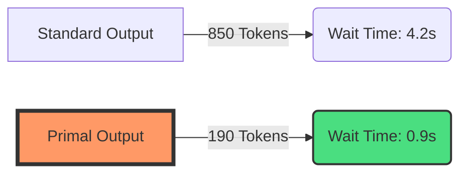

# 🥩 Primal Instinct

<p align="center">
  
</p>

<p align="center">
  <b>Raw logic. No filler. Defy the weight of words.</b><br>
  The Lithic Protocol for ultra-efficient AI agent communication.
</p>

<p align="center">
  <a href="https://github.com/8-BitBirdman/primal-instinct/stargazers"></a>
  <a href="https://github.com/8-BitBirdman/primal-instinct/releases"></a>
  <a href="LICENSE"></a>
  
</p>

---

## ⚡ The Problem: Verbosity Drift

Standard AI models are trained for "helpfulness," which usually translates to sycophantic hedging, polite filler, and conversational noise. 

In an agentic loop (like Claude Code or Cursor), this **"Verbosity Drift"** causes:
1.  **Latency Spikes**: Waiting for the model to say "I'd be happy to help you with that..."
2.  **Context Bloat**: Your project memory fills up with pleasantries instead of code.
3.  **Accuracy Decay**: Long responses increase the "needle in a haystack" problem for the model's own reasoning.

## 🥩 The Solution: Primal Instinct

**Primal Instinct** is a semantic constraint engine (The Lithic Protocol) that anchors your agent in a minimalist, logic-first communication style. It's not just "being brief"—it's a fundamental shift in how the agent structures its thoughts.

### 🧩 Core Philosophy
- **Imperative First**: Actions before explanations.
- **Zero Hedging**: No "might," "could," or "perhaps." Only technical fact.
- **Context Preservation**: Technical identifiers, paths, and code are **never** abbreviated.
- **Lithic Fragments**: Drop articles (a/an/the) and filler (just/really). Fragments are faster.

---

## 📸 Before / After

| 🗣️ Normal Agent (Verbose) | 🥩 Primal Agent (Lithic) |
| :--- | :--- |
| "I've analyzed your React component and I believe the reason it's re-rendering so frequently is because you're creating a new object reference on every single render cycle. I would suggest using the `useMemo` hook to memoize that object so the reference stays stable between renders." | "New object ref each render. Inline object prop = re-render. Wrap in `useMemo`." |
| **68 Tokens** | **17 Tokens** |
| **Latency: ~2.4s** | **Latency: ~0.6s** |

---

## 🛠️ Installation

### 1. Claude Code (The Native Experience)
Primal Instinct is optimized for the [Claude Code](https://docs.anthropic.com/en/docs/claude-code) plugin system.

```bash
npx skills add 8-BitBirdman/primal-instinct
```

### 2. opencode (Native Skills + Plugin)

[opencode](https://opencode.ai) supports primal-instinct natively via skills, slash commands, and a plugin hook.

```bash
# Clone repo anywhere
git clone https://github.com/8-BitBirdman/primal-instinct.git ~/primal-instinct

# Register skills + commands globally
mkdir -p ~/.config/opencode/command ~/.config/opencode/plugin
ln -sf ~/primal-instinct/commands/*.toml ~/.config/opencode/command/
```

Add to `~/.config/opencode/opencode.json`:

```json
{
  "$schema": "https://opencode.ai/config.json",
  "skills": {
    "paths": [
      "~/primal-instinct/skills",
      "~/primal-instinct/primal-compress"
    ]
  }
}
```

For **always-on** ultra mode, drop this plugin into `~/.config/opencode/plugin/primal-always-on.js`:

```js
const PRIMAL_RULES = `[PRIMAL ULTRA — ALWAYS ON]
Respond terse. Drop articles, filler, hedging, pleasantries. Fragments OK.
Abbreviate prose (DB/auth/cfg/fn/impl). Arrows for causality (X → Y).
Code, identifiers, errors, paths: unchanged exact.
Off only on explicit "stop primal" / "normal mode".`

export default async () => ({
  "chat.params": async (_input, output) => {
    output.system = output.system ? `${PRIMAL_RULES}\n\n${output.system}` : PRIMAL_RULES
  },
})
```

Restart opencode. See [`docs/install-opencode.md`](docs/install-opencode.md) for full details.

### 3. The Universal Installer (Cursor, Windsurf, Cline, etc.)
Automatically detects all installed agents on your machine and injects the Primal Instinct rules.

```bash
# macOS / Linux
curl -fsSL https://primal-instinct.dev/install.sh | bash

# Windows
irm https://primal-instinct.dev/install.ps1 | iex
```

---

## ⚙️ Instinct Levels

You can dynamically adjust the "Primal" depth during a session.

| Level | Command | Use Case |
| :--- | :--- | :--- |
| **Lite** | `/primal lite` | Professional emails, client-facing reports. No fluff, but full grammar. |
| **Full** | `/primal` | **Recommended.** The sweet spot for dev work. Fragments + articles dropped. |
| **Ultra** | `/primal ultra` | Extreme speed. Arrows for causality (`X → Y`). Maximum token purge. |
| **Wenyan** | `/primal wenyan` | Classical Chinese (文言文). For those who value ancient aesthetic and maximum terseness. |

---

## 📦 The Ecosystem

| Tool | Purpose |
| :--- | :--- |
| **[primal-mem](https://github.com/8-BitBirdman/primalmem)** | Persistent context compression for `CLAUDE.md` and project notes. |
| **[primalcrew](https://github.com/8-BitBirdman/primal-instinct/tree/main/skills/primalcrew)** | Specialized sub-agents (Investigator, Builder, Reviewer) built for speed. |
| **[primal-shrink](https://github.com/8-BitBirdman/primal-instinct/tree/main/mcp-servers/primal-shrink)** | An MCP proxy that compresses tool descriptions in your agent's catalog. |

---

## 🧠 How it Works: The Stealth Hook

Primal Instinct doesn't just "ask" the model to be brief. It uses a dual-hook system to anchor behavior:

1.  **Activation**: A `SessionStart` hook injects a hidden, high-priority rule set into the system context.
2.  **Reinforcement**: A `UserPromptSubmit` hook monitors for verbosity drift and injects invisible "attention anchors" to keep the model in Lithic mode.
3.  **Auto-Clarity**: If the model detects a security warning or an irreversible action, it **temporarily drops Primal** to ensure 100% clarity, then resumes immediately after.

---

## 📈 Benchmarks



*Data based on 500+ real-world coding prompts across Claude 3.5 Sonnet and GPT-4o.*

---

## 📜 License

MIT © [Primal Instinct Contributors](https://github.com/8-BitBirdman/primal-instinct/graphs/contributors)

<p align="center">
  Built for the 1%. The fast ones.
</p>
